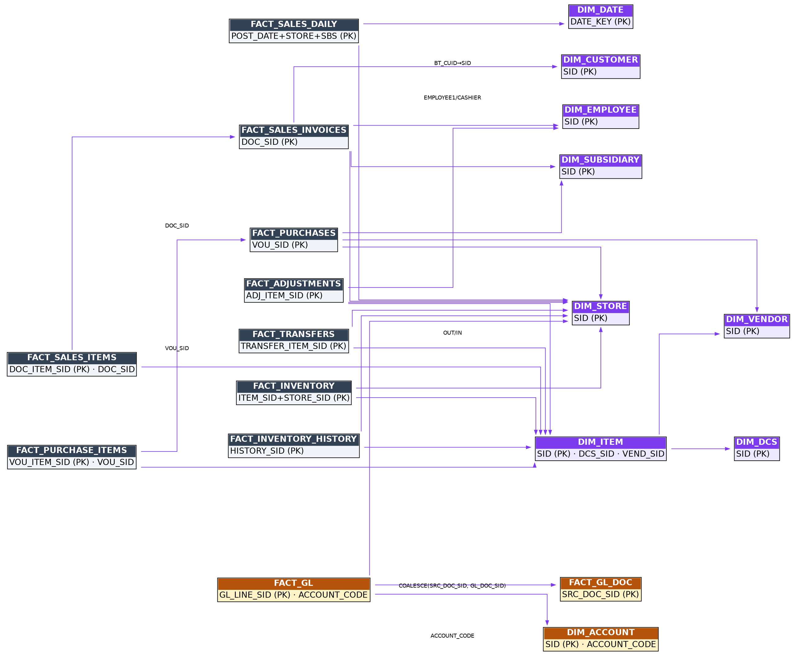

# 1. Architecture at a Glance

RetailTec Analytics is a **two-database system**:

| Layer | Engine | Role |
|---|---|---|
| **Source** | Oracle 12c+ (`RPS` schema) | The live Retail Pro Prism database. Read-only for Analytics — the app never writes to it. |
| **Warehouse** | DuckDB (single file) | A local star-schema copy optimized for analytics. All dashboards and reports read ONLY from this file. |

The sync engine (`backend/db/sync.py`) extracts from Oracle over the network, transforms in-flight, and loads into DuckDB. Users never wait on Oracle: every screen is served from the local warehouse in milliseconds.

**Warehouse file location:** one file **per Oracle server**, named `retailtec_<host with dots as underscores>.db` (e.g. `retailtec_10_0_0_5.db`), stored next to the app state (in the packaged install: `<install dir>\_internal\`). Switching the connection host in Settings switches the active warehouse file, so multiple customers/servers never mix data.

# 2. The Oracle Source (RPS schema)

## 2.1 Tables read, per domain

| Domain | Oracle tables | Notes |
|---|---|---|
| Sales | `RPS.DOCUMENT`, `RPS.DOCUMENT_ITEM`, `RPS.TENDER` | Headers, item lines, and payment lines of POS receipts. |
| Inventory (on-hand) | `RPS.INVN_SBS_ITEM_QTY`, `RPS.INVN_SBS_ITEM`, `RPS.INVN_SBS_PRICE` + `RPS.PRICE_LEVEL` | Snapshot quantities, cost, and price level 1. |
| Inventory history | `RPS.INVENTORY_HISTORY` | Trigger-log of quantity changes (a Prism customization — the app detects its presence). |
| Purchases | `RPS.VOUCHER`, `RPS.VOU_ITEM` | Receiving vouchers and their lines. |
| Transfers | `RPS.SLIP`, `RPS.SLIP_ITEM` (+ `RPS.VOUCHER` for the reversing voucher number) | Transfer slips between stores. |
| Adjustments | `RPS.ADJUSTMENT`, `RPS.ADJ_ITEM`, `RPS.CONTROLLER` | Memo/quantity adjustments; controller supplies a fallback store. |
| Dimensions | `RPS.STORE`, `RPS.SUBSIDIARY`, `RPS.EMPLOYEE`, `RPS.CUSTOMER` + `RPS.CUSTOMER_PHONE`, `RPS.INVN_SBS_ITEM`, `RPS.DCS`, `RPS.VENDOR` | Master data mirrored into DIM_* tables. |
| Accounting (virtual GL) | `RPS.DOCUMENT` + `RPS.DOCUMENT_ITEM` **of subsidiary 100** + the Prism *touch-menu* tables (for the account classification tree) + `RPS.INVN_SBS_ITEM` (chart of accounts) | See Volume 5 for the full design. |
| Tenders | `RPS.TENDER`, `RPS.TENDER_CREDIT_CARD` | `TENDER_CREDIT_CARD` joins 1:1 by `TENDER_SID`; `CARD_TYPE_NAME` carries the real card brand. |

## 2.2 Source facts every developer must know

1. **`STATUS = 4` means posted/closed — and closed documents are IMMUTABLE.** In Prism a closed document of any type can never be voided or reopened; corrections always create a NEW opposite document (a return is its own document). The posted fact stream is therefore append-only at source. This is the foundation of the warehouse's insert-only load model.
2. **Hard deletes exist only as DBA actions on subsidiary 100** (the accounting customization's custom-GL documents). They cannot happen in production for normal transactions. Consequently only `FACT_GL` needs replace-semantics; every other fact is safe with insert-only loads.
3. **All RPS text columns are `NVARCHAR2`.** Mixing charsets inside a recursive CTE / CASE / UNION raises `ORA-12704 (character set mismatch)`. Every accounting query wraps literals with `TO_NCHAR(...)` / `N'...'` and anchors recursive CTEs with an `NVARCHAR2` cast. Any new SQL against RPS must follow the same rule.
4. **`TENDER_TYPE` enum** (from the DB column comment): 0 Cash, 1 Check, 2 Credit Card, 3 COD, 4 Charge, 5 Store Credit, 6 Split, 7 Deposit, 8 Payments, … 15 Central Gift Card, 17 Central Customer Credit, 18 Loyalty. Values 0–32 are reserved by Retail Pro; this installation uses **19–28 as Custom Tenders 1–10**.
5. **Function-based date indexes** exist on the big tables (`IDX_DOCUMENT7` on `CAST(INVC_POST_DATE AS DATE)`, `IDX_CREATEDDATE_VOU`, `IDX_CREATEDDATE_SLIP`, `IDXADJUSTMENT`, `IDX_INV_HIST_DATE` — the latter four on `SYS_EXTRACT_UTC(created)`). The extraction SQL is written to *match these expressions exactly* so Oracle uses an index range scan (0.1 s) instead of a full scan of millions of rows. The UTC-based predicates are widened by ±1 day for timezone skew and paired with a plain local-time predicate that filters exactly.
6. **Index vs full-scan strategy:** windows ≤ 92 days get an `INDEX` hint; wider windows (historical backfills) get `FULL(H)` — one sequential scan beats hundreds of thousands of scattered ROWID lookups over a WAN. Constant: `_INDEX_WINDOW_DAYS = 92` in `sync.py`.
7. **Scale (production reference):** `DOCUMENT` ≈ 2.4M rows, `DOCUMENT_ITEM` ≈ 5.0M, `VOU_ITEM` ≈ 4.6M, `SLIP_ITEM` ≈ 4.3M, `INVENTORY_HISTORY` ≈ 3.1M — roughly 19M fact rows over six years.

## 2.3 Watermark columns (incremental sync keys)

| Domain | Watermark column | Why |
|---|---|---|
| Sales | `DOCUMENT.INVC_POST_DATE` | The business posting date; indexed; designed watermark. |
| Purchases | `VOUCHER.CREATED_DATETIME` | No posting timestamp exists on vouchers. |
| Transfers | `SLIP.CREATED_DATETIME` | Same. |
| Adjustments | `ADJUSTMENT.CREATED_DATETIME` | Same. |
| Inventory history | `INVENTORY_HISTORY.ACTION_DATE` | The trigger stamp. |

**Never watermark on `MODIFIED_DATETIME`:** closed documents are immutable *except their notes*, and a note edit bumps `MODIFIED_DATETIME`, which would needlessly re-pull years-old documents.

# 3. The DuckDB Warehouse

Schema version **8** (`SCHEMA_VERSION` in `backend/db/model.py`; the app migrates older files automatically with additive `ALTER TABLE IF NOT EXISTS` statements). ~29 tables in three groups: 9 dimensions, 11 facts, 9 ETL/control tables. Relationships are **implicit** (no FK constraints — joins are by convention, documented in §4).

## 3.1 Dimensions

### DIM_DATE
Calendar spine, pre-populated. `DATE_KEY (PK)`, `YEAR`, `QUARTER`, `MONTH_NUM`, `MONTH_NAME`, `WEEK_NUM`, `DAY_OF_MONTH`, `DAY_OF_WEEK` (0=Monday…6=Sunday), `DAY_NAME`, `IS_WEEKEND`.

### DIM_STORE
`SID (PK)`, `STORE_CODE`, `STORE_NAME`.

### DIM_SUBSIDIARY
`SID (PK)`, `SBS_NO`, `SBS_NAME`. Subsidiary 100 (the virtual GL) is **quarantined from every non-accounting extract and screen** and never counts toward the licensed subsidiary limit.

### DIM_EMPLOYEE
`SID (PK)`, `FULL_NAME`.

### DIM_CUSTOMER
`SID (PK)`, `CUST_ID` (human-facing customer number; display/search only), `FULL_NAME`, `PHONE` (primary phone via `CUSTOMER_PHONE`, `PRIMARY_FLAG DESC, SEQ_NO, SID` pick). Loaded windowed: customers appearing on documents in the loaded range.

### DIM_ITEM
`SID (PK)`, `SBS_SID`, `ALU`, `UPC`, `DESCRIPTION1/2/3/4`, `LONG_DESCRIPTION`, `ATTRIBUTE`, `ITEM_SIZE`, `DCS_SID`, `VEND_SID`, `ACTIVE`, `TEXT1–TEXT10`, `UDF1–UDF5_STRING`, `PRICE_LVL1/2/3`. **Fully refreshed every sync** (windowed loading once left fact-referenced items missing → "(unknown item)"). The optional columns feed the configurable grid columns feature (server-side whitelist `ITEM_EXTRA_FIELDS`).

### DIM_DCS
Department/Class/Subclass: `SID (PK)`, `SBS_SID`, `DCS_CODE`, `D_NAME`, `C_NAME`, `S_NAME`.

### DIM_VENDOR
`SID (PK)`, `SBS_SID`, `VEND_CODE`, `VEND_NAME`.

### DIM_ACCOUNT (chart of accounts — accounting only)
`SID (PK)`, `ACCOUNT_CODE` (= the item ALU), `ACCOUNT_KEY` (= `UDF5_STRING`, the **stable logical key**), `NAME_EN`, `NAME_AR`, `ACCOUNT_CLASS`, `ACCOUNT_GROUP` (level-2 branch of the Prism accounting touch menu; NULL when the account hangs directly under a class), `CLASS_SEQ` (level-1 branch order → statement section order), `CLASS_SOURCE` (`'tree'` = classified in the Prism touch menu, `'default'` = built-in integration default, `'manual'` = carried over). `ACCOUNT_CLASS` is deliberately **nullable and never inferred from the code range** — the COA mixes two numbering schemes, so classification comes only from the accountant's tree.

## 3.2 Facts

### FACT_SALES_DAILY *(aggregate, replaced per window each sync)*
PK `(POST_DATE, STORE_SID, SUBSIDIARY_SID)`. `SALES_COUNT`, `RETURN_COUNT`, `ORDER_COUNT`, `NET_SALES_WOTAX`, `INVOICE_DISC`, `TOTAL_TAX`, `TOTAL_DEPOSIT`, `TOTAL_FEES`, `SHIPPING_AMT`, `TOTAL_WTAX`, `GROSS_WOTAX`, `RETURN_WOTAX`, `RETURN_UNITS`. Rebuilt from FACT_SALES_INVOICES for the synced window — the one fact with replace semantics besides FACT_GL.

### FACT_SALES_INVOICES *(insert-only)*
PK `DOC_SID`. Header-level: `DOC_NO`, `INVC_POST_DATE`, `RECEIPT_TYPE` (0 sale / 1 return / 2 order), `SUBSIDIARY_SID`, `STORE_SID`, `EMPLOYEE1_SID`, `CASHIER_SID`, `BT_CUID` (customer), quantities (`SOLD_QTY`, `RETURN_QTY`), money (`NET_SALES_WOTAX`, `TOTAL_TAX`, `INVOICE_DISC`, `ITEM_DISC`, `LOYALTY_DISC`, `TOTAL_DEPOSIT`, `TOTAL_FEES`, `SHIPPING_AMT`, `TOTAL_WTAX`, `GROSS_WOTAX`, `RETURN_WOTAX`, `RETURN_UNITS`) and the tender split (`CASH_AMT`, `CARD_AMT` (types 2+11), `DEPOSIT_AMT` (type 7), `OTHER_AMT`). `NET_SALES_WOTAX` and `TOTAL_TAX` are **signed** (negative on return documents); return money lives in `RETURN_SUBTOTAL_WITH_TAX`-family source columns because `SALE_*` is zero on RECEIPT_TYPE=1 documents.

### FACT_SALES_ITEMS *(insert-only)*
PK `DOC_ITEM_SID`. `DOC_SID`, `INVC_POST_DATE`, `SUBSIDIARY_SID`, `STORE_SID`, `ITEM_SID`, `ITEM_TYPE` (`'Sale'`/`'Return'` — a *sale receipt can contain returned items*, which is why gross/returns are measured here, not from headers), `QTY`, unit measures (`UNIT_COST`, `UNIT_ORIG_PRICE_WOTAX/WTAX`, `UNIT_PRICE_WOTAX`, `UNIT_TAX_AMT`, `UNIT_PRICE_WTAX`, `UNIT_ITEM_DISC`, `UNIT_RECEIPT_DISC`, `UNIT_LOYALTY_DISC`) and line totals (`TOTAL_COST`, `TOTAL_ORIG_PRICE_WOTAX`, `TOTAL_PRICE_WOTAX`, `TOTAL_TAX_AMT`, `TOTAL_PRICE_WTAX`).

### FACT_INVENTORY *(snapshot upsert)*
PK `(ITEM_SID, STORE_SID)`. `SUBSIDIARY_SID`, `ON_HAND_QTY`, `COST`, `PRICE1`, `SYNCED_AT`. Guarded: a source read returning 0 rows never empties the existing snapshot.

### FACT_INVENTORY_HISTORY *(insert-only)*
PK `HISTORY_SID`. `ACTION_TYPE`, `ACTION_DATE`, `STORE_SID`, `ITEM_SID`, `QTY`, `COST`, `SBS_SID`. Only present where the customization exists (feature-detected).

### FACT_TRANSFERS *(insert-only)*
PK `TRANSFER_ITEM_SID`. `SLIP_SID`, `SLIP_NO`, `SLIP_DATE`, `VOU_NO`, `VOU_CLASS`, `VOU_STATUS`, `OUT_STORE_SID`, `IN_STORE_SID`, `ITEM_SID`, `SENT_QTY`, `RECV_QTY`, `UNIT_COST`, `TOTAL_COST`, `TOTAL_PRICE`.

### FACT_ADJUSTMENTS *(insert-only)*
PK `ADJ_ITEM_SID`. `ADJ_SID`, `ADJ_NO`, `ADJ_DATE`, `STORE_SID` (85% of headers have NULL store — the loader falls back to the creating controller's store, then `ORIG_STORE_SID`), `EMPLOYEE_SID`, `DOC_TYPE`, `ITEM_SID`, `ORIG_QTY`, `ADJ_QTY`, `QTY_DIFF`, `UNIT_COST`, `COST_DIFF`.

### FACT_PURCHASES *(insert-only)*
PK `VOU_SID`. `VOU_NO`, `VOU_DATE` (= `CAST(CREATED_DATETIME AS DATE)`), `STATUS`, `SUBSIDIARY_SID` (the voucher's own `SBS_SID`), `STORE_SID`, `VEND_SID`, `EMPLOYEE_SID` (=`CLERK_SID`), `VOU_SUBTOTAL`, `VOU_TOTAL`, `DISC_AMT`, `LINE_COUNT`, `ORD_QTY`, `RECV_QTY`. Filter: `NVL(SLIP_FLAG,0)=0 AND NVL(HELD,0)=0` (transfer-generated and held vouchers excluded).

### FACT_PURCHASE_ITEMS *(insert-only)*
PK `VOU_ITEM_SID`. `VOU_SID`, `VOU_DATE`, `SUBSIDIARY_SID` (from parent voucher), `STORE_SID`, `VEND_SID`, `ITEM_SID`, `ORD_QTY`, `RECV_QTY`, `UNIT_COST`, `UNIT_PRICE`, `DISC_AMT`, `TOTAL_COST` (=qty×cost), `TOTAL_RETAIL` (=qty×price).

### FACT_GL *(window-replace on every load)*
PK `GL_LINE_SID`. One row per GL line of the virtual ledger (subsidiary 100). `GL_DOC_SID`, `GL_DOC_NO`, **`POST_DATE`** (the ACCOUNTING date — for poster journals the *source document's* date carried in NOTE8; for manual entries the sbs-100 document's own date), **`GL_POST_DATE`** (when the books actually received the entry — the sbs-100 document's own `INVC_POST_DATE`; both dates are kept because accountants need both, and the reports offer a "date basis" toggle), `ACCOUNT_SID`, `ACCOUNT_CODE`, `STORE_SID`, `SUBSIDIARY_SID`, source metadata (`SRC_SBS_NO`, `SRC_STORE_CODE`, `SRC_DOC_SID`, `SRC_DOC_NO`, `SRC_DOC_TYPE`, `BP_ID`) and money (`DEBIT`, `CREDIT`, `AMOUNT` = signed, debit-positive). Three derived journal categories (never stored): **Payment** (`SRC_DOC_TYPE LIKE 'P_%'`), **Transaction** (`SRC_DOC_SID IS NOT NULL` and not Payment), **Entry** (`SRC_DOC_SID IS NULL` — a manual journal keyed directly into Prism; its NOTE fields are absent so source columns load as NULL, never faked).

### FACT_GL_DOC *(derived locally after each GL load)*
PK `SRC_DOC_SID` — holding `COALESCE(FACT_GL.SRC_DOC_SID, GL_DOC_SID)`: the source document for poster journals (which must net to zero across ALL its journals), the GL document itself for manual entries (which must balance within themselves). `POST_DATE`, `GL_POST_DATE`, `SRC_DOC_NO`, `SRC_STORE_CODE`, `STORE_SID`, `JOURNALS`, `LINES`, `NET`, **`IS_BALANCED`** — drives the reporting gate: unbalanced units are excluded from the statements and surfaced by GL Exceptions, so money is never silently dropped.

## 3.3 ETL / control tables

| Table | Purpose |
|---|---|
| `SYNC_RUN` | One row per sync run: type (full/incremental/range), trigger, date range, chunk progress, timing, error. |
| `SYNC_RUN_STATS` | Per-table row counts per run. |
| `SYNC_WATERMARK` | Per-domain `loaded_from` / `loaded_to` — the span actually present, shown in Settings → "Loaded Data". |
| `SYNC_VALIDATION` | Post-load validation results. |
| `FEATURE_AVAILABILITY` | Which optional Prism customizations exist on this server (inventory history, accounting). |
| `WAREHOUSE_META` | Key/value per warehouse file: `source_host` (license binding — a copied file on another server shows UNLICENSED COPY), `dims_loaded_at` (12-h dimension-reload throttle), `sub_limit_since` (subsidiary-limit grace start). |
| `DIM_USERS` | App users, bcrypt password hashes, roles, per-user page permissions, store scoping. |
| `AUDIT_LOG` | Admin/user actions (logins, settings saves, loads, license installs…). |
| `USER_PREFS` | Saved views, grid column state, UI preferences. |

## 3.4 Load semantics summary

| Mode | What happens |
|---|---|
| **Incremental** (on-open, scheduled, tray) | Window = last **N days, minimum 30** (options 30/60/90). Immutable facts: INSERT-only anti-join on PK (re-reading is harmless). FACT_SALES_DAILY: window rebuilt. FACT_GL: **window delete + reload** (absorbs sbs-100 DBA wipes within the window). FACT_INVENTORY: snapshot upsert. DIM_ITEM + small dims refreshed (≤ every 12 h). |
| **Full load** | Same, over each domain's configured history window (per-domain "Keep history" setting). |
| **Range load** | Explicit From→To, append by default; **"Replace this period"** checkbox = delete range first (`rebuild`). |
| **Replace everything** (per-domain dropdown) | `full-load?rebuild=true` for one domain over its own window — delete + reload. Audited. |
| **Retention** | Per-domain `retain_detail_months` prunes old *line detail* (daily summaries are kept forever). |

The 30-day incremental floor makes every refresh a rolling self-healing window: late postings and accounting reposts inside the last 30 days are absorbed automatically.

# 4. ERD

**Join conventions** (implicit — enforce in SQL, not schema):

| From | To | On |
|---|---|---|
| FACT_SALES_ITEMS | FACT_SALES_INVOICES | `DOC_SID` |
| FACT_SALES_* | DIM_STORE / DIM_SUBSIDIARY / DIM_EMPLOYEE / DIM_CUSTOMER | `STORE_SID` / `SUBSIDIARY_SID` / `EMPLOYEE1_SID`,`CASHIER_SID` / `BT_CUID = DIM_CUSTOMER.SID` |
| FACT_SALES_ITEMS / FACT_INVENTORY* / FACT_TRANSFERS / FACT_ADJUSTMENTS / FACT_PURCHASE_ITEMS | DIM_ITEM | `ITEM_SID` |
| DIM_ITEM | DIM_DCS / DIM_VENDOR | `DCS_SID` / `VEND_SID` |
| FACT_TRANSFERS | DIM_STORE ×2 | `OUT_STORE_SID`, `IN_STORE_SID` |
| FACT_PURCHASE_ITEMS | FACT_PURCHASES | `VOU_SID` |
| FACT_PURCHASES | DIM_VENDOR | `VEND_SID` |
| FACT_GL | DIM_ACCOUNT | `ACCOUNT_CODE` |
| FACT_GL | FACT_GL_DOC | `COALESCE(SRC_DOC_SID, GL_DOC_SID)` — always use this COALESCE (`_doc_key()` in the routers) |
| any fact date | DIM_DATE | date column = `DATE_KEY` |

A browsable HTML version (`RetailTec-Warehouse-ERD.html`) ships in the repository.

# 5. Reliability & Operations

- **SQL bind assertion:** every warehouse query goes through helpers that assert the `?` placeholder count matches the parameter list *before* execution, failing with a clear message naming the query.
- **WAL self-heal:** if DuckDB's write-ahead log is corrupt at startup (force-kill leftovers), the app quarantines it to `wal_quarantine\` beside the file, logs loudly, and retries once. Only the last un-checkpointed batch is lost — and the ≥30-day incremental window re-pulls it on the next sync. A WAL merely *held by a live instance* is never touched.
- **Single-writer model:** one shared DuckDB connection for sync writes; every API request gets its own cursor (MVCC) so dashboards read concurrently while a sync runs.
- **Instance takeover:** `duckdb.connect` retries for up to 120 s when another instance still holds the file (tray Restart overlap).
- **Backups:** Settings → Maintenance — manual "Backup Now", weekly CHECKPOINT + monthly backups with retention, and Restore (keeps a pre-restore safety copy). Backups are safe while the app runs.
- **Defender/build trap (dev machine):** never delete `packaging\out` right after the app ran — Windows Defender holds the `.db` for minutes. Build code into `out2` and robocopy over, excluding state files.
